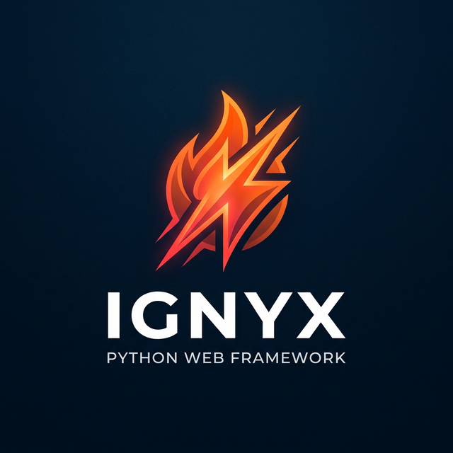

<p align="center">
  
  <br>
  <em>Ignite your API. Built in Rust, runs in Python.</em>
</p>

<p align="center">
  <a href="https://github.com/sakethdevx/ignyx/releases/">
    
  </a>
  <a href="https://github.com/sakethdevx/ignyx/actions/workflows/release.yml">
    
  </a>
  <a href="https://github.com/sakethdevx/ignyx">
    
  </a>
  <a href="https://github.com/sakethdevx/ignyx/blob/main/LICENSE">
    
  </a>
</p>

---

**Ignyx** is an insanely fast, concurrent, and robust asynchronous web framework for Python. 
Under the hood, it drops down into a highly optimized, multi-threaded **Rust Core** via `PyO3`, completely sidestepping Python's Global Interpreter Lock (GIL) bottleneck during high-throughput network event loops.

If you love the Developer Experience (DX) of FastAPI, but need the raw multi-core scaling infrastructure of Go or Rust, Ignyx is for you.

## ✨ Features

- **Blazing Fast**: See the [Benchmark](#%EF%B8%8F-the-benchmark-87x-faster-than-fastapi) — up to **8.7x** faster than FastAPI for raw JSON serialization and dynamic routing.
- **Fearless Concurrency**: Network I/O, parsing, and connection pooling are handled concurrently in Rust thread pools before ever touching Python.
- **Native Async/Await**: 100% standard Python `async def` and `await` compatibility.
- **Pydantic Validation**: Ships out-of-the-box with `pydantic>=2.0` schema validation logic for fast, strict JSON enforcement.
- **Deeply Typed**: Complete generic typing inference and `py.typed` compliance out of the box for perfect IDE autocompletion.
- **Routers**: Full support for modular, FastAPI-style hierarchical `Router` objects.

## 📦 Installation
Requirements: Python 3.12+

```bash
pip install ignyx
```

## 🛠️ Quickstart

Let's build a simple, screaming-fast JSON API:

```python
from ignyx import Ignyx

app = Ignyx()

@app.get("/")
async def root():
    return {"message": "Hello from Rust-powered Python!"}

if __name__ == "__main__":
    # Spins up the optimized Rust HTTP listener
    app.run(host="0.0.0.0", port=8000)
```

## 🚀 Advanced Modular Example
Ignyx scales beautifully to enterprise API patterns. Just like mature frameworks, it supports nested routers, request unpacking, and typed response overrides.

```python
from ignyx import Ignyx, Router, JSONResponse

app = Ignyx()
users_router = Router(prefix="/users")

# Simulated async database fetch
async def fake_db_lookup(user_id: str):
    return {"id": user_id, "name": "Saketh", "role": "admin"}

@users_router.get("/{user_id}")
async def get_user_profile(user_id: str):
    data = await fake_db_lookup(user_id)
    # Return explicit JSONResponses or standard Python dictionaries
    if not data:
        return JSONResponse({"error": "User not found!"}, status_code=404)
        
    return JSONResponse(data)

# Include the modular router into the core app
app.include_router(users_router)

if __name__ == "__main__":
    app.run(workers=4)
```

---

## ⚡️ The Benchmark: 8.7x Faster than FastAPI

Why is it so fast? When an HTTP request comes in, a **hyper**-backed Rust server engine accepts the connection, parses the packets, strips the headers, and prepares the asynchronous payload across isolated worker threads *before* the Python GIL wakes up. You only pay for Python execution exactly when you need business logic.

*Tested on MacBook Air M2 (native ARM64). Both frameworks configured identically (CORS + Pydantic + dynamic routing).*

| Endpoint | Ignyx (Rust Engine) | FastAPI (Uvicorn) | Speedup | Latency |
| :--- | :--- | :--- | :--- | :--- |
| **`/plaintext`** | **53,886 req/s** | 6,193 req/s | 🔥 **8.70x** | **2.22ms** |
| **`/users/{id}`** | **48,988 req/s** | 5,597 req/s | 🔥 **8.75x** | **2.39ms** |
| **`/users`** (JSON) | **44,178 req/s** | 5,200 req/s | 🔥 **8.49x** | **2.61ms** |

*(Tool: `wrk -t4 -c100 -d10s`)*

## 🤝 Contributing
Want to make the fastest Python framework even faster? Contributions to both the Python wrapper and the core Rust HTTP engine are highly welcome!

**Setting up the Dev Environment:**
Because the core is Rust, you'll need `maturin`.

```bash
# 1. Clone the repository
git clone https://github.com/sakethdevx/ignyx.git
cd ignyx

# 2. Create a virtual environment
python -m venv venv
source venv/bin/activate

# 3. Install dependencies and compile the Rust extensions dynamically
pip install -r requirements.txt
pip install maturin
maturin develop  # Installs the local Rust code dynamically as `ignyx._core`

# 4. Run the Python tests
pytest tests/
```

## 📜 License
This project is licensed under the [MIT License](LICENSE).